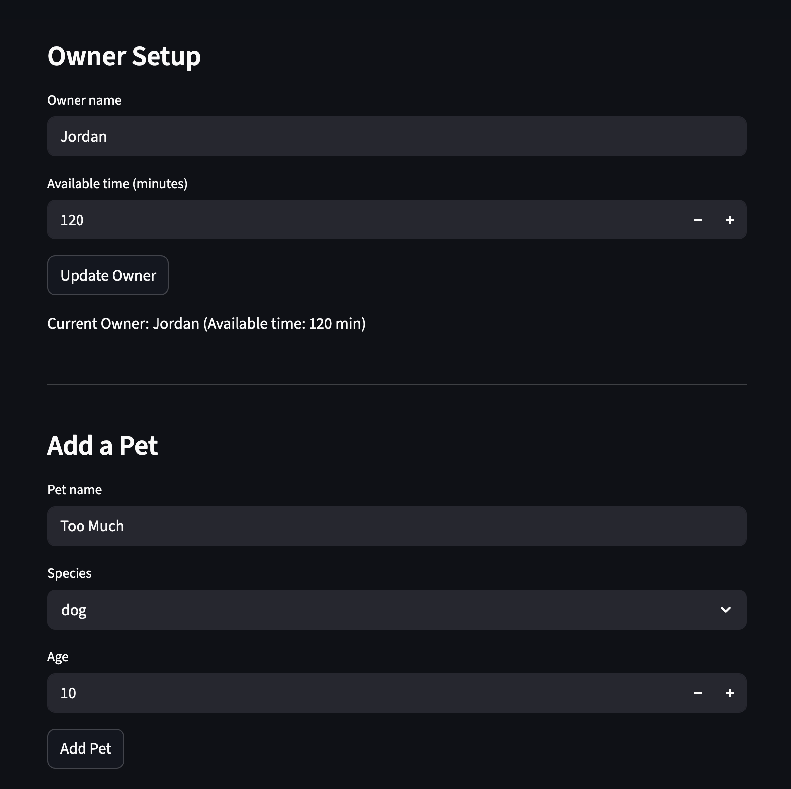

# PawPal+ Project Reflection

## 1. System Design

**a. Initial design**

- Briefly describe your initial UML design.

Started with a simple domain model: Owner, Pet, Service, Appointment.

Owner is the scheduler actor: has name, available time, and can create appointments.

Pet is the subject: name/species/age + method to expose pet info.

Service is task definition: name/description/duration + method to explain service.

Appointment is the concrete schedule entry: date/time/duration + linked Pet + Service; methods to schedule/cancel.

Relationships:
Owner → many Pet
Owner → schedules many Appointment
Appointment ↔ Pet
Appointment ↔ Service

- What classes did you include, and what responsibilities did you assign to each?
**Pet
    stores identity fields (name,species,age)
    get_info(): reusable description for UI text and plan explanation
    purpose: isolate pet-specific data and avoid scattering this in scheduler logic

**Owner
    stores user context (name,available_time)
    manages the owner’s pet collection and time budget
    get_pets(): central lookup for scheduling / UI
    schedule_appointment(...): entrypoint to create/refuse an appointment
    purpose: where constraints and high-level planning are anchored
    
**Service
    stores activity metadata (name,description,default_duration)
    get_details(): wraps domain knowledge into human text
    purpose: decouples “task definition” from “task execution” so scheduler can compose them flexibly
    
**Appointment
    stores scheduled record (date,time,duration,pet,service)
    schedule(), cancel(): explicit lifecycle and validation hooks
    purpose: makes plan output verifiable and traceable (e.g., “was this task currently scheduled?”)

**b. Design changes**

- Did your design change during implementation?
Yes, my design changed during implementation.

- If yes, describe at least one change and why you made it.
One key change was adding bidirectional relationship attributes (e.g., pets list in Owner, owner in Pet, appointments in Pet, and owner in Appointment) and implementing state-maintaining logic in methods like Owner.schedule_appointment(). This was necessary to fix bottlenecks like orphaned objects and inconsistent data, ensuring relationships from the UML diagram were properly enforced in code for reliable scheduling and navigation. Without these, the system would have struggled with queries (e.g., finding an owner's pets) and state management as logic was added.
---

## 2. Scheduling Logic and Tradeoffs

**a. Constraints and priorities**

- What constraints does your scheduler consider (for example: time, priority, preferences)?
The scheduler considers three constraints: available time (the owner's total time budget in minutes), task priority (low/medium/high mapped to scores 1–3), and task duration (how long each task takes). It also respects completion status — only pending tasks are eligible for the daily plan.

- How did you decide which constraints mattered most?
Available time came first because it is a hard limit — no matter how important a task is, it cannot run if there is no time left. Priority came second because it determines which tasks get scheduled when time is tight. Duration was used as a tiebreaker within the same priority level, favouring shorter tasks so more items can fit into the budget. Completion status was a prerequisite rather than a ranking factor, since scheduling an already-done task would produce nonsensical output.

**b. Tradeoffs**

- Describe one tradeoff your scheduler makes.
The scheduler only checks for exact time matches in conflict detection instead of handling overlapping durations (e.g., a 30-min task at 8:00 overlaps with a 15-min task at 8:15). This tradeoff prioritizes simplicity and performance for small task lists, avoiding complex interval logic, but may miss subtle conflicts in real use. It's reasonable for a basic app, as pet owners can manually adjust times, and full overlap detection would require more code and computation.

- Why is that tradeoff reasonable for this scenario?
PawPal+ is designed for a single owner managing a small number of pet care tasks per day — typically fewer than ten. At that scale, exact-time conflict detection catches the most obvious scheduling mistakes (two tasks assigned the same start time) without the overhead of interval arithmetic. Pet care tasks also tend to have natural buffers between them (feeding, walking, grooming), so the chance of a legitimate but subtle overlap is low. If the app were extended to support multiple caretakers or tightly packed professional schedules, full interval-overlap detection would become necessary, but it would be over-engineering for the current use case.

---

## 3. AI Collaboration

**a. How you used AI**

- How did you use AI tools during this project (for example: design brainstorming, debugging, refactoring)?
I used AI tools across all phases of the project. During design, I brainstormed class responsibilities and relationships by describing the problem scenario and asking the AI to critique my UML draft. During implementation, I used it to debug `times_overlap` logic and to refine how `mark_task_complete` should spawn a new recurring task. During the Streamlit integration phase, I asked it to suggest how to wire `st.session_state` to keep owner and pet data alive across reruns.

- What kinds of prompts or questions were most helpful?
The most useful prompts were specific and grounded in the actual code: "Given this `detect_conflicts` method, why would two tasks at 08:00 not always register as a conflict?" and "What is the minimal change to `Owner` to support filtering tasks by pet name?" Vague prompts like "help me with the scheduler" produced generic answers, while precise ones with code snippets produced actionable suggestions.

**b. Judgment and verification**

- Describe one moment where you did not accept an AI suggestion as-is.
When I asked for help implementing conflict detection, the AI initially suggested comparing only start times as strings — returning `True` when `task1.start_time == task2.start_time`. I did not accept this because it would miss genuine overlaps (e.g., a 30-minute task at 08:00 overlapping a task starting at 08:20) and would also produce false positives if tasks on different pets happened to share the same start string without actually clashing.

- How did you evaluate or verify what the AI suggested?
I traced through two manual examples — one clear overlap and one adjacent-but-not-overlapping pair — against both the suggested logic and my revised `times_overlap` implementation using `datetime` interval arithmetic. Only the interval version correctly handled both cases. I then added those same examples as test cases in `main.py` (the task at 08:00 for "Morning walk" and 08:00 for "Evening grooming") to confirm the final version detected the conflict and reported it correctly.

---

## 4. Testing and Verification

**a. What you tested**

- What behaviors did you test?
I tested task sorting by time (ensuring tasks are ordered chronologically regardless of insertion order), status filtering (separating completed from pending tasks), pet-level task filtering (retrieving only tasks belonging to a named pet), conflict detection (catching two tasks whose time windows overlap), the daily plan generation (verifying high-priority tasks are selected first and the total duration stays within the owner's budget), and the recurring task behaviour (confirming that marking a daily task complete adds a fresh copy while leaving the original as completed).

- Why were these tests important?
Each test guarded a distinct failure mode that would break the user experience: wrong sort order makes the schedule unreadable; missed conflicts cause the owner to double-book time; a greedy planner that ignores the time budget would schedule impossible days; and a broken recurrence model would silently drop tasks the owner expects to see again the next day.

**b. Confidence**

- How confident are you that your scheduler works correctly?
I am confident the scheduler handles the core happy-path cases correctly. The `main.py` script exercises sorting, filtering, conflict detection, plan generation, and task completion in sequence and produces consistent output. The `times_overlap` logic was manually verified against overlapping and non-overlapping pairs. My main uncertainty is around edge cases that were not explicitly tested, such as tasks that span midnight, tasks with no `start_time`, or an owner with zero available time.

- What edge cases would you test next if you had more time?
- A task with `start_time=None` passed to `detect_conflicts` — the current guard skips it silently, but that should be made explicit.
- Two tasks whose windows are exactly adjacent (one ends at 09:00 and the next starts at 09:00) — these should not be flagged as a conflict, and the `max < min` check in `times_overlap` handles this correctly, but I would add a dedicated assertion.
- An owner with `available_time_minutes` smaller than the shortest task — `get_daily_plan` should return an empty list.
- Adding the same pet twice to an owner — `get_all_tasks` would then return duplicate tasks, which could inflate conflict reports.

---

## 5. Reflection

**a. What went well**

- What part of this project are you most satisfied with?
I am most satisfied with the `times_overlap` implementation and how it connects to the broader scheduling pipeline. Moving from a naive string comparison to proper `datetime` interval arithmetic (`max(start1, start2) < min(end1, end2)`) was a small change in code but a meaningful leap in correctness. It made the conflict detection genuinely useful rather than a cosmetic feature, and it forced me to think carefully about what "conflict" actually means in a time-based system.

**b. What you would improve**

- If you had another iteration, what would you improve or redesign?
I would redesign the `Scheduler.get_daily_plan` method to be time-aware rather than only budget-aware. Currently it packs tasks by total minutes without assigning or checking actual clock positions, so a "plan" could include two tasks that conflict with each other in time even though they fit within the budget. The fix would be to sort candidates by start time first and then greedily assign them while advancing a running clock pointer — rejecting any task whose start time falls inside an already-scheduled window.

**c. Key takeaway**

- What is one important thing you learned about designing systems or working with AI on this project?
The most important thing I learned is that AI is most valuable as a thinking partner when you already have a concrete design question, not a vague one. When I asked broad questions like "help me build the scheduler," the AI produced plausible-looking code that missed the specific constraints of my domain. When I asked narrow questions anchored in my actual code — "why does this overlap check fail for adjacent tasks?" — the AI gave precise, verifiable answers. The lesson is that good system design and good AI collaboration share the same prerequisite: knowing exactly what problem you are trying to solve before you start.

---

## 📸 Demo

